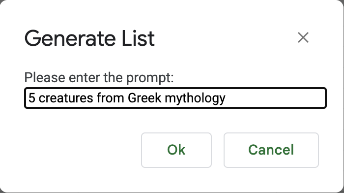
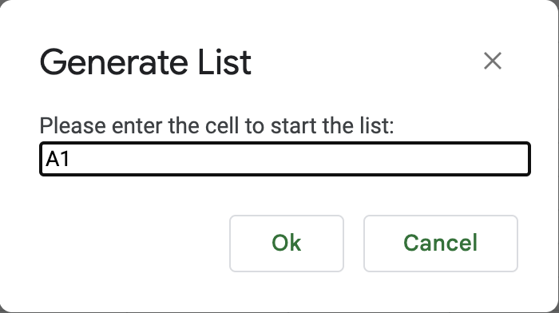
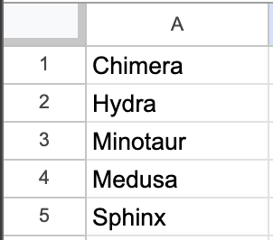
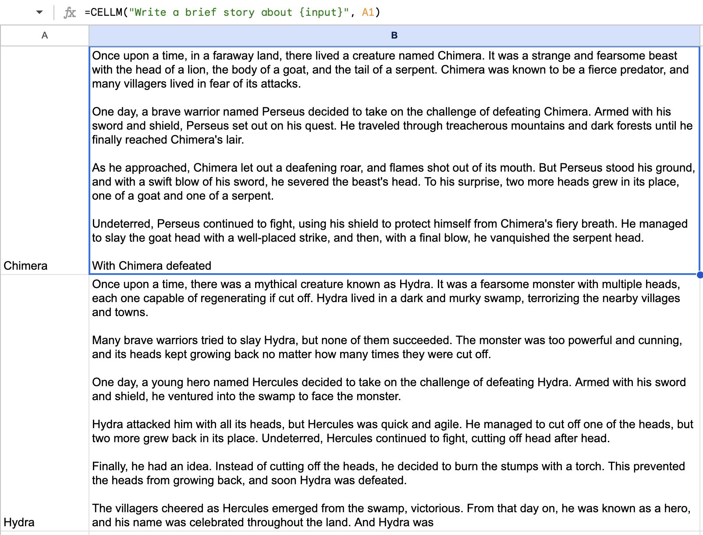
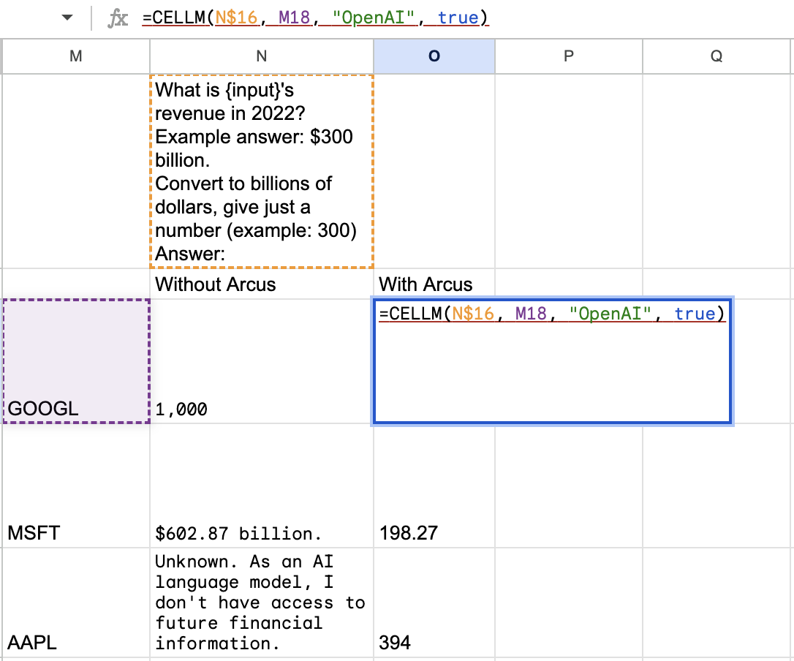
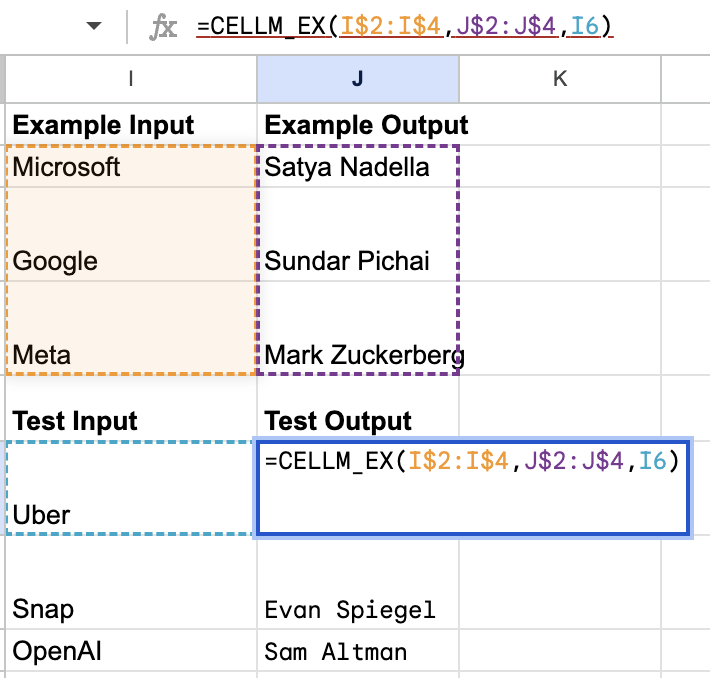
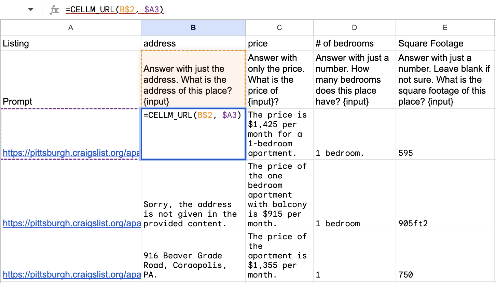

# Getting started
1. Generate the `all.gs` file containing all the code (or use the existing one if you haven't made changes):
```
chmod +x gen_all.sh
./gen_all.sh
```
2. Go to the Google Sheets spreadsheet that you would like to use CeLLM in. In the menu, click **Extensions &rarr; Apps Script**. This will open an Apps Script editor.
3. Replace the default `Code.gs` file contents with the contents of `all.gs` from Step 1. Add an HTML file with the + icon and name it `Sidebar`. Fill in the contents from the [`Sidebar.html`](Sidebar.html) in the repo. Save the project.
4. Refresh the Google Sheets. After a few seconds, a menu called "CeLLM" should appear in the menu bar. This means the add-on has loaded.
5. Click **CeLLM &rarr; Setting**s**. You will be prompted to authorize the script. After authorizing, return to Settings. Enter your API keys and click Save. This information is saved to the [User Properties service](https://developers.google.com/apps-script/guides/properties) and is only accessible to your account on this spreadsheet. If you share the spreadsheet, other users will not see your API keys and will need to enter their own in order to use CeLLM in the spreadsheet.
6. You should now be able to use the **CeLLM &rarr; Generate List** feature as well as the spreadsheet functions `CELLM`, `CELLM_EX`, and `CELLM_URL` (in development). These functionalities are documented below.


# Documentation
Note that the spreadsheet functions (starting with `CELLM`) must include all arguments in order. That means if you want to specify the temperature, you must specify all preceding arguments as well. This is due to lack of support in JavaScript for keyword arguments.
## Generate List
This functionality is useful for using LLMs to generate lists of items across multiple cells. Due to access limitations, this functionality can't be accomplished through spreadsheet functions, so it's tucked away in **CeLLM &rarr; Generate List**.
First input: prompt describing list |  Second input: cell starting the list | Output
:---------------------:|:---------------------:|:---------------------:
  |    |  


## `CELLM`
This is the spreadsheet function used to apply a prompt to a cell. The function is called as follows:
```
CELLM(prompt, input, llm, arcus, max_tokens, temperature)
```
The first two arguments are required, and the rest are optional.
- `prompt` (string): The prompt to apply to the input. Any occurrences of the string "{input}" in the prompt will be replaced with the value of the `input` parameter. If no occurrences are found, the input will be appended to the end of the prompt instead.
- `input` (string): The value to be combined with the prompt as described above.
- `llm` (optional, string): One of "OpenAI" (default) or "Anthropic", optionally including a colon-separated model name selected from "gpt-3.5-turbo" (default) or "gpt-4" (if your API key has access) for OpenAI, or the model options found [here](https://console.anthropic.com/docs/api/reference#-v1-complete) (default "claude-instant-v1") for Anthropic. For example, "OpenAI:gpt-4" uses OpenAI's GPT-4 model, and "Anthropic:claude-v1-100k" uses Anthropic's Claude v1 model that accepts a 100k token context window.
- `arcus` (optional, boolean): Whether or not to use Arcus' [prompt enrichment](https://app.arcus.co/docs/prompt/key-concepts/) to add in relevant data to the prompt when available. Requires Arcus API key and Project ID to be set in **CeLLM &rarr; Settings**. Default `false`.
- `max_tokens` (integer): The maximum number of tokens allowed for the LLM response. Defaults to 250 to prevent rapid cost increases (OpenAI and Anthropic charge by the token).
- `temperature` (float): A value between 0-2 (OpenAI) or 0-1 (Anthropic). Per the OpenAI documentation, higher values will make the output more random, while lower values will make it more focused and deterministic. Defaults to 0.3.





## `CELLM_EX`
This is the spreadsheet function used to generate outputs using example input-output pairs, rather than a prompt, to specify the task. The function is called as follows:
```
CELLM_EX(exampleInputs, exampleOutputs, testInput, llm, arcus, max_tokens, temperature)
```
The first three arguments are required, and the rest are optional.
- `exampleInputs` (cell range): The inputs for the example pairs. For example, A1:A5.
- `exampleOutputs` (cell range): The outputs for the example pairs.
- `testInput` (string): The input to produce an output for, based on the example input-output pairs.

The rest of the arguments are as described for `CELLM`, but `arcus` is ignored and set to `false` for now.




## `CELLM_URL`
This is the (in-development) spreadsheet function used to apply a prompt to a webpage. It can be used to extract information from a webpage with an LLM. The function is called as follows:
```
CELLM_URL(prompt, url, llm, arcus, max_tokens, temperature)
```
The first two arguments are required, and the rest are optional.
- `prompt` (string): The prompt to apply to the input. Any occurrences of the string "{input}" in the prompt will be replaced with the content of the webpage fetched from the `url` parameter. If no occurrences are found, the webpage content will be appended to the end of the prompt instead.
- `url` (string): The content of the `<body>` tag in the HTML fetched from this URL is stripped of HTML tags and used as input to the prompt.

The rest of the arguments are as described for `CELLM`, but `arcus` is ignored and set to `false` for now.

**NOTE**:
- Due to the token-based pricing, this function can run up costs pretty quickly.
- Long webpages can result in hitting the LLM max token limit.
- Specifying one of Anthropic's 100k token models (such as with `llm="Anthropic:claude-v1-100k"` or `llm="Anthropic:claude-instant-v1-100k"`) allows CeLLM to process much longer webpages. Be mindful of running up costs with large webpages though.

